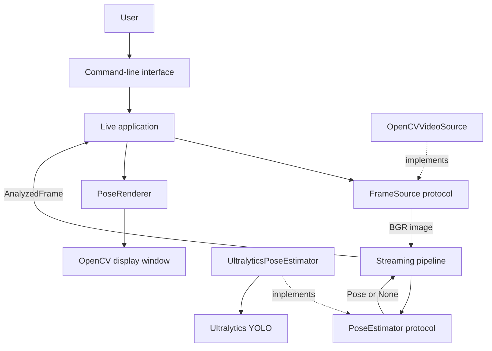

# Handstand Coach

Handstand Coach is a real-time computer vision application that uses a webcam to detect human pose and visualize body keypoints.

The long-term goal is to analyze handstand alignment and provide explainable posture feedback. The project is also a software-engineering exercise in building a testable computer vision system with clear component boundaries, application-owned data models, and reproducible development workflows.

## Project status

**Week 1 milestone complete:** the application can open a webcam or video source, run pose estimation continuously, display a confidence-aware skeleton, report detection status, and release its resources safely.

Session recording, posture metrics, and coaching feedback will be added in later milestones.

## Features

- Real-time webcam and video capture with OpenCV
- YOLO pose estimation through Ultralytics
- Model-independent, normalized pose data
- Confidence-aware skeleton rendering
- Clear `Pose detected` and `No pose detected` states
- Processing-FPS display
- Command-line configuration for source, model, and confidence threshold
- Graceful handling of unavailable cameras and missing models
- Automated tests that do not require physical camera hardware


## Quick start

### Prerequisites

- Git
- Python 3.11–3.13
- Conda or another Python environment manager
- A webcam or readable video file

Clone the repository:

```bat
git clone https://github.com/Sssylvia33/handstand-coach.git
cd handstand-coach
```

Create and activate a Conda environment:

```bat
conda create -n handstand-coach python=3.13 pip
conda activate handstand-coach
```

Install the application and development tools in editable mode:

```bat
python -m pip install -e ".[dev]"
```

Start live pose detection with the default camera:

```bat
handstand-coach live --source 0
```

The default model is `yolov8n-pose.pt`. Ultralytics may download the model weights automatically on the first run if they are not already available.

## Usage

Use a different camera index:

```bat
handstand-coach live --source 1
```

Analyze a video file:

```bat
handstand-coach live --source path\to\video.mp4
```

Use a different pose model:

```bat
handstand-coach live --model path\to\pose-model.pt
```

Change the minimum keypoint confidence:

```bat
handstand-coach live --confidence-threshold 0.6
```

Show all available options:

```bat
handstand-coach live --help
```

While the live window is open:

- Press `q` to stop.
- Closing the window also stops the session.
- `Pose detected` means at least one usable pose was returned.
- `No pose detected` is a normal state; frame processing continues.

## Architecture

Handstand Coach separates hardware access, model inference, application data, and visualization. This keeps the core pipeline testable without requiring a real camera or running an ML model in every test.



### Component responsibilities

| Component | Responsibility |
|---|---|
| `cli.py` | Parses user configuration and reports application errors clearly. |
| `live.py` | Orchestrates the live session, display loop, and resource lifecycle. |
| `capture.py` | Provides frames from cameras or video files through the `FrameSource` protocol. |
| `stream.py` | Processes frames lazily and adds frame indices, timestamps, and processing time. |
| `estimation.py` | Defines the model-independent `PoseEstimator` contract. |
| `ultralytics_estimator.py` | Adapts Ultralytics results into application-owned pose objects. |
| `models.py` | Defines immutable keypoints, poses, and per-frame pose data. |
| `visualization.py` | Renders confidence-filtered skeletons without depending on Ultralytics result objects. |

### Per-frame data flow

1. `OpenCVVideoSource` reads a BGR image.
2. The streaming pipeline passes the image to a `PoseEstimator`.
3. The estimator returns a normalized `Pose` or `None`.
4. The pipeline creates a `PoseFrame` containing the frame index, timestamp, image dimensions, and pose result.
5. `PoseRenderer` converts normalized keypoints back to pixel coordinates and draws the skeleton.
6. The live application displays the annotated image and user status.

### Design decisions

- **Application-owned pose models:** downstream code does not depend on Ultralytics result objects.
- **Normalized coordinates:** stored keypoints remain meaningful across different image resolutions.
- **Protocols instead of concrete dependencies:** fake sources and estimators can replace hardware and ML inference during testing.
- **Explicit `None` pose state:** a frame without a detected person remains part of the stream instead of being discarded.
- **Context-managed video sources:** camera resources are released during normal exits and exceptions.
- **Separate rendering:** saved pose data can later be visualized without rerunning inference.

This structure also supports future extensions. Week 2 can save `PoseFrame` objects without changing camera or inference code, while a future Raspberry Pi version can introduce another `FrameSource` or `PoseEstimator` implementation.

## Testing

Run the automated test suite:

```bat
python -m pytest
```

Run linting and formatting checks:

```bat
python -m ruff check .
python -m ruff format --check .
```

Automated tests use fake frame sources, estimators, clocks, and Ultralytics results. This allows the pipeline, resource lifecycle, error handling, coordinate conversion, and rendering behavior to be tested without requiring a physical camera.

Real-camera behavior is verified separately with a manual acceptance checklist:

- Start and stop using `q`
- Stop by closing the display window
- Transition between pose and no-pose states
- Reopen the camera after shutdown
- Report unavailable camera sources clearly
- Report missing model files without exposing a traceback

## Current limitations

- Only the highest-confidence person is analyzed.
- The generic YOLO pose model is not trained specifically for handstands.
- Pose estimation is two-dimensional and depends on camera placement.
- Processing FPS measures inference-pipeline performance, not total display latency.
- Sessions and pose data are not saved yet.
- Posture metrics and coaching feedback are not implemented yet.
- A dedicated phone interface is outside the current MVP.

## Roadmap

- [x] **Week 1 — Live pose pipeline:** camera capture, pose estimation, skeleton rendering, CLI, error handling, and automated tests
- [ ] **Week 2 — Session data:** record sessions and save structured per-frame pose data
- [ ] **Week 3 — Posture analysis:** calculate explainable alignment, joint-angle, and balance metrics
- [ ] **Week 4 — Coaching MVP:** feedback rules, end-to-end tests, documentation, and portfolio demo
- [ ] **Post-MVP — Edge deployment:** evaluate Raspberry Pi deployment using OpenVINO or another optimized inference backend